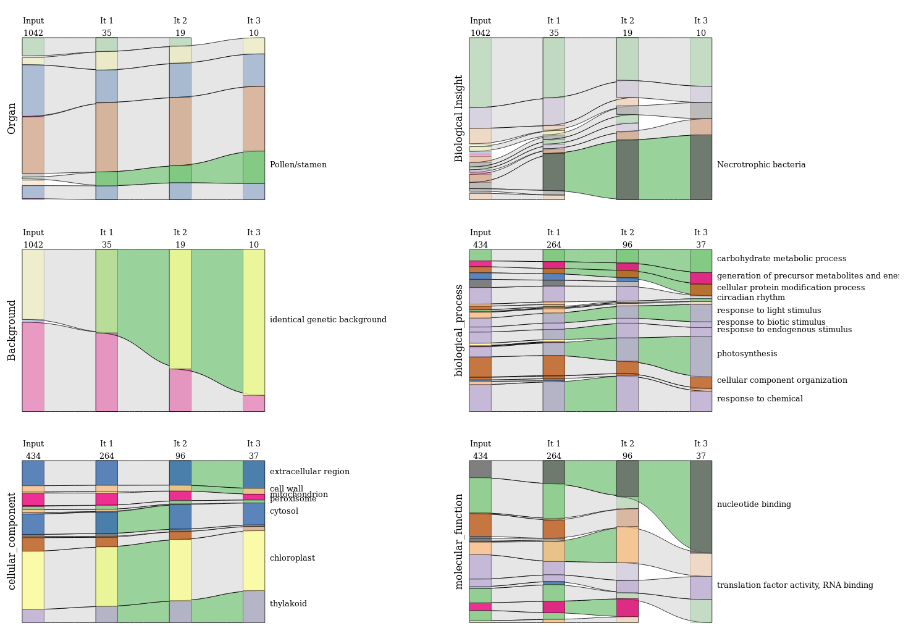
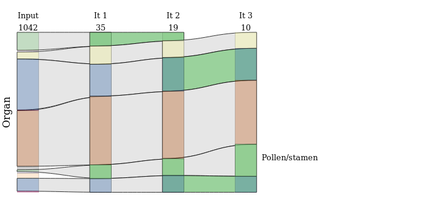
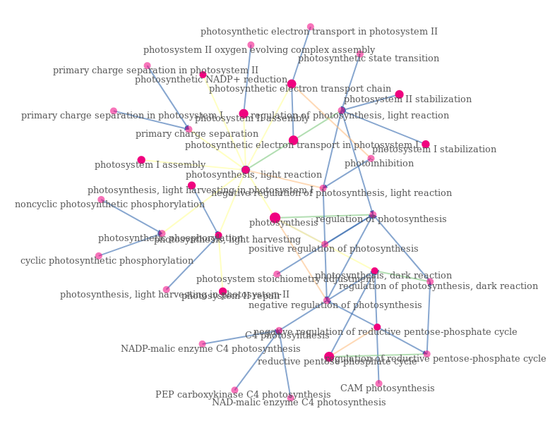

# Construction of visualizations to represent metadats evolutions into genes cluster

## Abstract
Over the past several years, there has been an increase in the size and diversity of the data studied. This observation is particularly marked in the field of transcriptomics, where the need to integrate and visualize large volumes of heterogeneous data arises.

CoRGI is a web application of bi-clustering implemented in JavaScript. This tool uses a matrix of genes and experiments from transcriptomic data and aims to identify groups of genes working together. At present, the results can be visualized by directly accessing the matrix, a color code is used to represent the induction or repression of genes.

In order to be able to effectively interpret the results of CoRGI it is necessary to set up a visualization method to visualize the evolution of the metadata of the cluster of genes, but also to be able to access to the details of a given iteration. The IRHS bioinformatics team has set up metadatas to describe experiments. Functional annotation of genes using the GO has been implemented to describe genes. A set of alluvial diagrams is set up to monitor the evolution of gene metadata and experiments during iterations of the CoRGI algorithm. Force-directed graphs are built to be able to visualize the details of a given iteration. These two methods used together have made it possible to build an effective visualization to help the biologist interpret the results of CoRGI.

## Visualizations produced

The visualization of metadata evolutions during CoRGI iterations is done via two types of graphs.

#### Alluvial diagrams
Alluvial diagrams provide a global vision and a temporal dimension. Since the metadata is divided into six categories (three categories to describe the experiments and three parts of the Gene Ontology (GO) for genes). The figure below shows these six alluvial diagrams.

An example of a particular sankey diagram is shown in next figure.

This type of graph represents the processes (GO terms or terms describing the metadata) in the form of a colored rectangle. They are opaque if they are significantly over-represented compared to the TAIR data set. They are linked by links that are colored green if they are significantly over represented by the input data set. Various additional information is available, including iteration numbers and the number of elements present in the matrix for it, but also when hovering over nodes or links with the mouse.

#### Force-directed graphs
Force-directed graphs provide access to more detail by using the term GO and not the term GO Slim. However, for reasons of readability, these graphs do not have time dimensions. The following example shows the graph directed by the force of the GO underlying the term "photosynthesis". The nodes are represented by circles whose opacity depends on whether he has annotated genes. Their size depends on the number of genes annotated with them. The links are colored according to the type of relationship they express ("is a", "regulates").

### Folder architectures

Data folder. It is empty since the data has not yet been published. This is the folder where to store the data.
The examples_of_visualizations folder stores some examples of visualizations produced using the repository scripts.
The profiling folder stores a JSON file resulting from the profiling of the application by Google CHrome.
protyping stock of python scripts used to prototype the various parsing and diagram construction steps.
python_precomputation stores some python scripts to prepare the data needed to build diagrams. This constitutes:
- The parsing of a CoRGI output.
- Annotations of the genes present in the CoRGI dataset
- Some functions allowing file conversions

The visualization folder stores all JavaScript files allowing the construction of visualizations. A libs folder will gather libraries of functions written during the course but also a version of the d3-sankey module rewritten to allow the construction of links of variable height.
conf folder. Stores a configuration file to configure the script for building visualizations.
The data folder will wait for data.  Finally, the sankey_experiments_and_genes folder stores the main function of the script allowing the construction of the visualizations.
